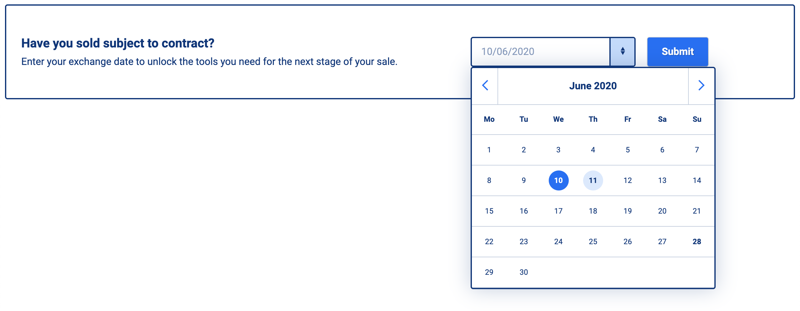

# Calendar Widget

## Start

`yarn start`

Runs the app in the development mode and it's available at [http://localhost:3000](http://localhost:3000) to view it in the browser.

## Test

`yarn test`

Launches the test runner in the interactive watch mode.

## Build

`yarn build`

Builds the app for production to the `build` folder.
It bundles React in production mode and optimizes the build for the best performance. The build is minified and the filenames include the hashes.
